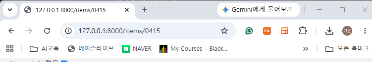

# 0908 수업

## 수업 중 새로운 정보

-변수의 값이 3개가 넘어가면 매변수 갯수를 유연하게 하는게 *.

-**면 json포맷이 유연하게 들어갈 수 있다. 

-인스톨: 패키지 | 그냥 쓰는거: 외부 라이브러리 | 정해진대로만 쓰는거:프레임워크

-null: 초기에 아무것도 세팅 안한 아무것도 없는 것

-string 값이 없다: none, null 혹은 공백 둘다 될수도 있음

## FastAPI

uv방식을 통해 서버 실행해야 함.(pip랑 다름)

FastAPI 다운로드: D:\cgy0902\ex0908>pip install "fastapi[standard]”

```jsx
#fastapi 예제
from fastapi import FastAPI
app = FastAPI()

@app.get("/")
	def read_root():
	return {"Hello": "World"}
	
@app.get("/items/{item_id}")
	def read_item(item_id: int, q: str | None = None):
	return {"item_id": item_id, "q": q}
	
#pip로 fastapi 실행 코드
D:\cgy0902\ex0908>fastapi dev main.py

#fastapi 실행 끊기
cntrl+c
```

fastapi 실행 코드: D:\cgy0902\ex0908>uvicorn main(main.py의 파일이름):app --reload  

                         #reload는 파일 다시읽어라

옵션: D:\cgy0902\ex0908>uvicorn main:app --port 8001  --reload #포트번호 8001로 변경

## 요청

get 요청: 검색창에 직접 요청하는 것 

> 
> 
> 
> 
> 

host 요청: form을 통해 아이디 pw 넣듯이 요청하는것 (백단에 요청 보내는 것)

[http://127.0.0.1:8000/docs](http://127.0.0.1:8000/docs) 

post 요청: 본문에 싸서 요청하는 것 

### fastapi 수업예제)

```jsx
from fastapi import FastAPI

app = FastAPI()

@app.get("/users")
async def read_users():
    return ["Rick", "Morty"]

@app.get("/users")
async def read_users2():
    return ["Bean", "Elfo"]
    
#해당경우에는 위에만 실행됨
```

