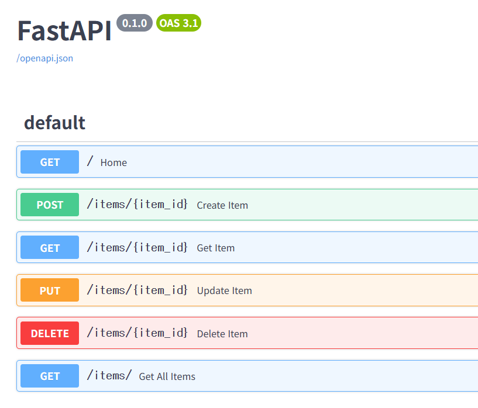

# 0909 수업

## 수업 중 새로운 정보

-복습 필요한 부분: W3 Python Functions 까지

-데이터를 한눈에 바라보는 가장 직관적인 방법은 시각화이고 그게 Matplotlib임

-폐쇄망이면 로컬 호스트 붙잡아서 해야함 (postman/swagger 공부하기)

-python은 자동으로 swagger 붙여줘서 하는데 원래는 from scratch해서 해야함. 

-프로젝트 운영문서에 꼭 들어가야 하는것은 API(경로)임

-validation이 더 중요함 기능 하나 더 넣는것보단

## Async/Await 및 asyncio 비동기 프로그램

-브라우저가 세션 하나를 물고 있을때 동작 하기 전까지는 그대로 있음

-sync: 물고있음. async: 필요할때만 물고있음

## Pydantic은 왜 필요한가

-데이터 타입을 미리 정리해주는 (숫자인지, 텍스트인지…)

-pydantic 안쓰면 if문으로 manual하게 다 물어봐야함 

## FastAPI

-Favicon: 웹페이지 왼상단에 있는 아이콘

#### POST

클라이언트가 서버에 **새로운 데이터를 보낼 때** 쓰는 요청 방식.

- `GET` = "보여줘" (조회)
- `POST` = "이거 등록해줘/만들어줘" (생성)

#### 기본 구조

python

```python
from fastapi import FastAPI
from pydantic import BaseModel

app = FastAPI()

# 1. 받을 데이터의 형식을 미리 정의
class Item(BaseModel):
name: str
price: float
is_sale: bool = False  # 기본값 (안 보내면 False)

# 2. POST 요청 처리
@app.post("/items")
async def create_item(item: Item):
return {"message": "등록 완료", "받은_데이터": item}
```

#### 핵심 포인트 3가지

1. **`BaseModel`로 데이터 형식 정의**
→ "이런 모양의 데이터만 받을게"라고 미리 규칙을 정해두는 것
2. **필수 값 vs 기본값**
    - `name: str` → 반드시 있어야 함 (없으면 에러)
    - `is_sale: bool = False` → 없으면 자동으로 `False`
3. **함수 매개변수에 `item: Item`만 적으면 끝**
→ FastAPI가 알아서 데이터 검증 + 파싱까지 처리해줌

#### 요청/응답 예시

**보내는 데이터 (클라이언트 → 서버)**

json

```json
{"name": "노트북", "price": 1500000, "is_sale": true}
```

**받는 응답 (서버 → 클라이언트)**

json

```json
{"message": "등록 완료", "받은_데이터": {"name": "노트북", "price": 1500000.0, "is_sale": true}}
```

#### 테스트하는 법

1. `uvicorn 파일명:app --reload` 로 서버 실행
2. 브라우저에서 `http://127.0.0.1:8000/docs` 접속(화면에서는 안보임)
3. `POST /items` 클릭 → `Try it out` → 값 입력 → `Execute`

#### DELETE

클라이언트가 서버에 **기존 데이터를 삭제해달라고 요청할 때** 쓰는 요청 방식.

- `GET` = "보여줘" (조회)
- `POST` = "이거 등록해줘/만들어줘" (생성)
- `DELETE` = "이거 삭제해줘" (삭제)

---

#### PUT

클라이언트가 서버에 **기존 데이터를 수정해달라고 요청할 때** 쓰는 요청 방식.

- `GET` = "보여줘" (조회)
- `POST` = "이거 등록해줘/만들어줘" (생성)
- `PUT` = "이거 수정해줘/바꿔줘" (수정)
- `DELETE` = "이거 삭제해줘" (삭제)
- —> 개발할 때 PUT(수정)이 제일 복잡함.

## CURD 관련 예시

| CRUD | HTTP | 역할 |
| --- | --- | --- |
| **C**reate | `POST` | 데이터 생성 |
| **R**ead | `GET` | 데이터 조회 |
| **U**pdate | `PUT` | 데이터 수정 |
| **D**elete | `DELETE` | 데이터 삭제 |

method가 같아도 HTTP가 다르면 작동함

ex) Swagger 화면

